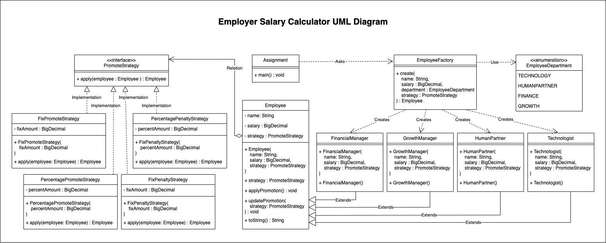

# **Employer Salary Calculator**

## **Work**

Worker salary calculations are a detail that should be done regularly in every company and company where there are employees and employers.

Many items are taken into account when calculating a worker's salary. Both the large number of calculation items and the complexity cause the margin of error. Making mistakes in even a single digit in mathematical operations can have huge consequences. Here, technology helps to eliminate the margin of error in worker salary calculations with new generation solutions.

With the employer salary calculation program, you can create your workers' payrolls completely and accurately. These processes, which are extremely complex, require a lot of labor and time if they are tried to be done manually. Thanks to the employer salary calculation program, it is possible to save on all these.

The purpose of this project is to easily calculate and track employee salaries.

When you hire a new staff member to your business, you must open a personal file for this staff. By using the employer salary calculation program, you save your employees with many different information on your system. Some of this information are: personnel information, department, salary etc.

Increases and deductions are applied in the most accurate and fast way in accordance with the salary policies created by the company. And you can easily replace your employee information with more up-to-date information at any time. In this way, you always make the salary calculation with the most up-to-date and accurate data, and you can legally secure your business.

Accurate calculation of the worker's salary ensures the employer and the workplace as well as the employees.

You can easily transfer information to your employees, accountants and financial advisors.

In order to keep this process as simple as possible, a system is created in which information about your employees is kept and calculations can be made easily. Thanks to the practical and fast employer salary calculation program, the personnel management process is optimized.

## **Statement Of Work**

When you hire a new staff member to your business, you must open a personal file.
You save your employees with some information on your system. Some of this information are: personnel information, department, salary etc.

Increases and deductions are applied to personal file with the salary policies created by the company.

Salary can be calculated based on a fixed or percentage increase or decrease. It should be easily produced with different strategies, added to the personnel file and be calculated quickly.

## **Design Patterns**

### **Factory Pattern**

- A Factory Pattern says that just define an interface or abstract class for creating an object but let the subclasses decide which class to instantiate.
In other words, subclasses are responsible to create the instance of the class.
- Factory Method pattern comes under “Creational Design Patterns”.
- In the Factory pattern, we create object without exposing the creation logic to the client and refer to newly created object using a common interface.

#### Advantages

- Factory Method Pattern allows the sub-classes to choose the type of objects to create. 
- It promotes the loose-coupling by eliminating the need to bind application- specific classes into the code.  
( That means the code interacts solely with the resultant interface or abstract class, so that it will work with any classes that implement that interface or that extends that abstract class. )

### **Strategy Pattern**

- Strategy pattern (known as policy) is a behavioral software design pattern that enables a behavior (an algorithm) to be selected at runtime.
- A Strategy defines a set of algorithms that can be used interchangeably.

#### Intent

- The behavior of a class to be independent from the clients that use it.
- By encapsulating each algorithm and make them interchangeable.
- Put the abstraction in an interface, push implementation details down to derived classes.
- The behavior can change in subclasses without side effects.

## **Implementation Of Design Patterns**

The Design Models that I use Factory Pattern and Strategy Pattern.

The Factory Pattern model allows new employees to be easily created in my project, taking into account the department type and promotion strategy set for the employee.

```java
Employee ozge = EmployeeFactory.create(
    name,
    salary,
    department,
    promoteStrategy
);
```

The Strategy Pattern model enables to apply the chosen promotional behavior to the worker and help worker information easily adapt to change. Also, the promotional strategy switches can be implemented quickly.

```java
ozge.updatePromotion(promoteStrategy);
ozge.applyPromotion();
```

## **Uml Diagram**
